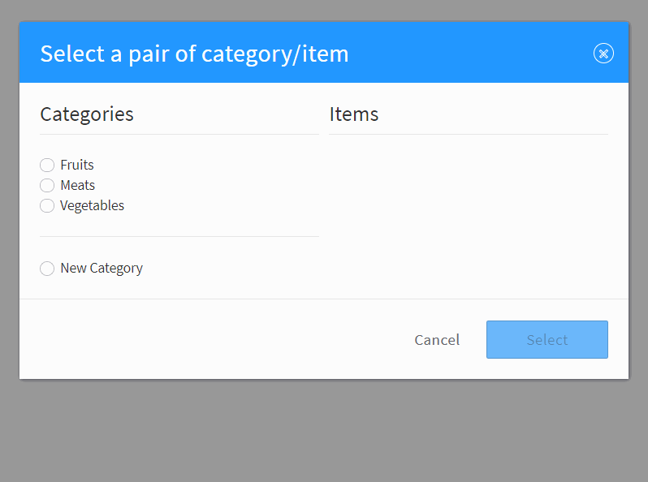

title: catItemSelector()

# catItemSelector



## Syntax
```javascript
monster.pub('common.catItemSelector.render', args)
```

### Parameters
`args` is a mandatory `Object` parameter with the following properties:

Key | Description | Type | Default | Required
:-: | --- | :-: | :-: | :-:
`isEditable` | | `Boolean` | `true` | `false`
`existing` | | `Object` | | `true`
`choices` | | `Function` | | `false`
`i18n` | | `Object` | | `false`
`onSelect` | | `Function` | | `false`
`onCancel` | | `Function` | | `false`
`onClose` | | `Function` | | `false`

## Description
